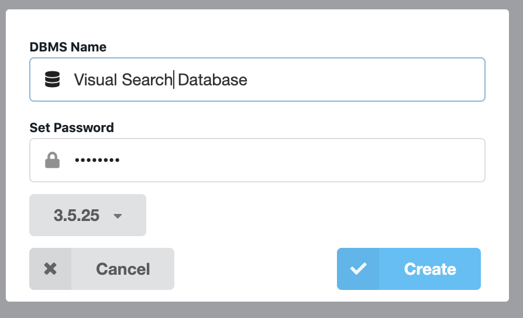
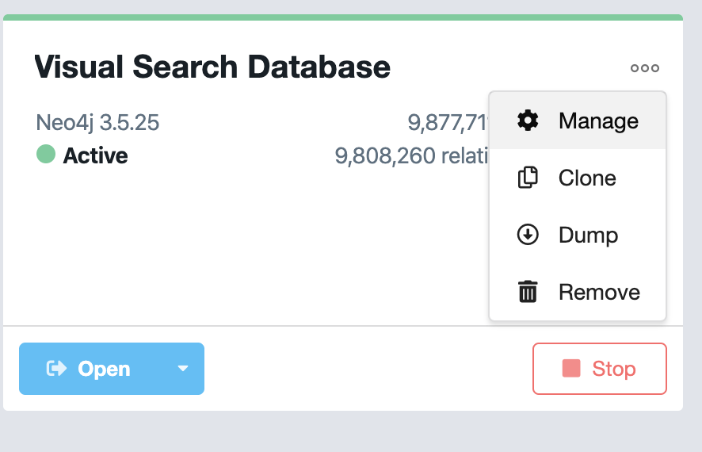
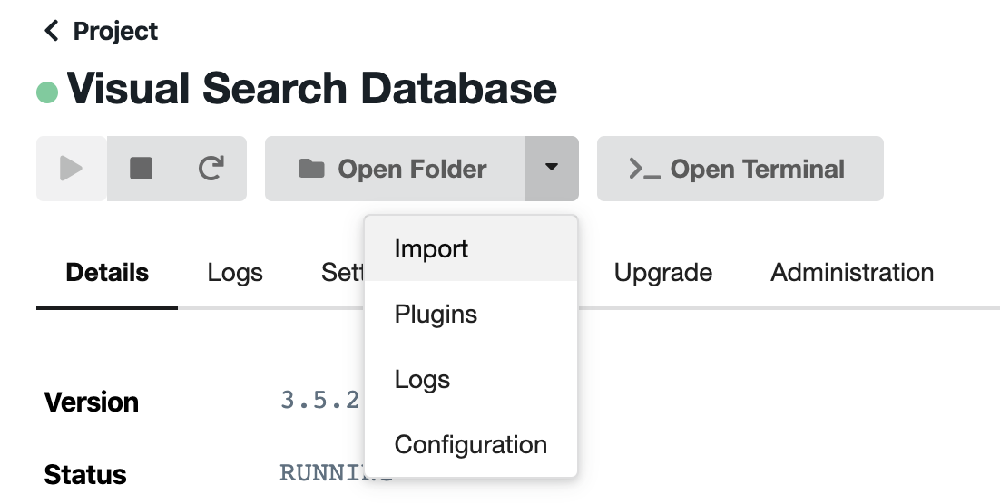

# Visual Search Database

This project aims to create a living and growing database of visual search datasets. This would be beneficial for the field from multiple perspectives. First, it will allow seeing the "big picture" by consolidating the data from the separate studies. In this way, it follows the idea of "domain-specific repositories" (such as, for example, http://metalab.stanford.edu/). Secondly, it will facilitate data re-use, so that researchers won't have to collect the same data anew because they aren't aware of or cannot access the data from previous studies. Thirdly, it will hopefully aid computational modeling, as researchers would able to test their models on the data from many different labs rather than limiting themselves to specific "exemplary" datasets. In the future, by linking theoretical accounts through computational models to the specific testable predictions, we would be able to see which theories provide a better account of the data and which phenomena remain hard to explain.

## Current status

The work on the database was on hiatus for a while, but we're trying to restart it. Here are some current stats:

* Papers/sources: 12
* Experiments: 46
* Participants: 1078
* Trials: 936405

The Shiny app using cached output from the database is here: https://achetverikov.shinyapps.io/VisualSearchDB/

## How is it organized?

The database can be deployed on a local machine using the scripts and the data available through this Github page. The `data` folder contains a subfolder for each data source and an import configuration template (more on that below). Each data source folder contains, raw data, preprocessed data along with preprocessing scripts, and the import configuration file. The raw data ( collected through open sources or provided directly by the authors) is preprocessed to fix small bugs and add missing info where needed. The import configuration file provides meta-details and the mapping from the data to the database properties. 

The [import configuration template](https://github.com/achetverikov/visual_search_db/blob/master/data/import_conf_template.yaml) is a crucial component that describes how the data sources should be annotated in order to be imported in the database. It is written in a very simple [YAML syntax](https://en.wikipedia.org/wiki/YAML) and contains two large sections: Meta and Dataset. The Meta section provides general details about the dataset. Who has added it (Maintainer), who are the authors of the dataset, where it was published, the license information, where the data was collected, and other things like that. The Dataset part is the description of the actual data, separated into Experiment, Block, Trial, and Stimuli subsections. Each section contains properties that can be used to describe related parts of the study.

In general, the import template follows the progressive enhancment principle. The level of details in the description can be quite different. You can just added the response times and accuracy and provide an approximate meta-description, but you can also add enough information to precisely reproduce each single trial pixel-by-pixel. The latter, of course, is ideal that we strive for. In reality, however, especially with the past studies, this might be difficult to achieve. 

## How to start adding data

This is very easy: fork or download the project, make a new folder in `data` and copy the raw data and the import template (`data/import_conf_template.yaml`) there. Start filling out the fields in the template (take a look at existing datasets for examples), and, if needed, add the script that would parse the raw data to preprocess it. To check if the configuration file is correct, use `read_vs_config()` function. Finally, you can test if the data can be loaded even without recreating the full database by setting a global variable `debug = 1` and trying to load the data with `load_data_neo4j()`. If everything works, make a commit to the repository. Skills needed: R, git. 

An even easier way: fill the import template with as many details as you can and send it to us (andrey.a.chetverikov@gmail.com). We'll try to add it and ask you for more info if needed. Skills needed: none.   

## Background

Visual search has a relatively long history and there are gazzilions of experiments done every year. Yet, when Andrey Chetverikov started doing his experiments he was really frustrated because it was quite difficult to find clear answers for seemingly simple questions (e.g., how does the spatial density of distractors interacts with the set size?). On the other hand, other simple questions seem to resurface over and over again as if the data collected before did not exist. We believe that part of the problem is that it is really difficult to find some data collected before you. Even now, when there is a strong movement towards open science, not many people publish their data and it is often pre-processed so that only the authors' hypothesis can be tested. Furthermore, a lack of machine-readable meta-data makes reanalysis of previous data a daunting task.

We have been working on a database and a standard for visual search experiments data. The idea is that the data should allow recreating the stimuli display precisely (and include the variables such as ITI that might affect the results). The final version of the project should allow the researchers to upload their data in a typical format (csv) along with a configuration file so that it will be automatically processed and included in the database. Finally, an online interface (currently, using Shiny: https://achetverikov.shinyapps.io/VisualSearchDB/) should be available to show some of the typical effects known in visual search. It’s a difficult task, but we had some progress so that now the data from our own experiments can be imported along with some of the publicly-available sets.

## Installation

For those who wants to run a database on their own machine - installation guide v0.02.

1. Get your own copy of the project - fork it, clone it, or download it.
2. Download & install neo4j from https://neo4j.com/. If you haven't used Neo4j before, install the desktop version (the following points assume you use the desktop version). 
3. Start neo4j. Create a database with version 3.5.x. The name of the database doesn't matter. Set the password.


4. Find out the import path. To do this, go to the database management (click on three dots to the right from the database name at the main screen of Neo4j desktop, then "Manage"), click on the arrow near "Open Folder" and choose import. 




5. Copy the path to this folder to `neo4j_import` variable in `import_data/connect_to_neo4j.R`. On MacOS, the path looks something like `/Users/UserName/Library/Application Support/com.Neo4j.Relate/Data/dbmss/dbms-13c3f0ca-ba6d-41ef-ae9e-8d56bc11a574/import/`. 
6. Install APOC plugin from the plugin tab of the database management screen.
7. Set username and password for neo4j also in `import_data/connect_to_neo4j.R`.
8. Open the project (visual_search_db.Rproj) with RStudio or just set the directory to the main directory of the project.
9. You may need to install additional packages: 
```
install.packages(c('devtools','yaml', 'data.table','stringr','digest'))
devtools::install_github('nicolewhite/RNeo4j')
devtools::install_github('thomasp85/patchwork')
devtools::install_github('achetverikov/APAstats')
```
10. Run `source('import_data/parse_config_for_neo4j.R')` 

Voila! In theory, everything should work now. You can test it by running:
```
load_data_neo4j('data/chetverikov_kristjansson_2015','import_conf.yaml')
load_data_neo4j('data/chetverikov_campana_kristjansson_2016','exp1_config.yaml')
```
Both should run without errors, the first one is fast, the second one is slower.


